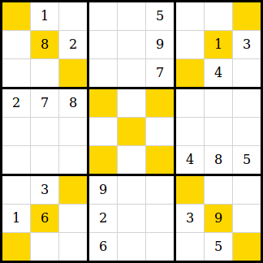

# Feladat

Készíts [SCSS](https://sass-lang.com/) stíluslapot a [diagonal-sudoku.html](diagonal-sudoku.html) dokumentum az alábbi módon történő megjelenítéséhez:

Az átlós cellák háttérszínét beállító szabályokat automatikusan kell generálni.

A feladvány [innen](http://sudoku.menu/diagonal.html) származik.
