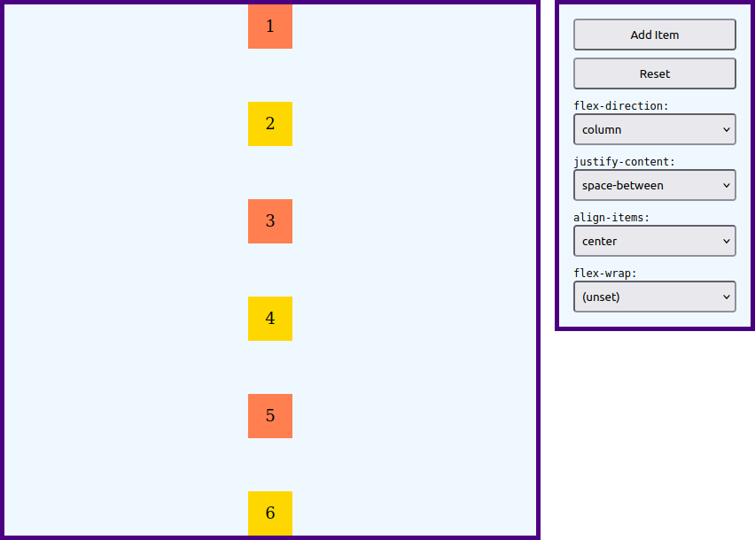

# Feladat

Készíts egy HTML dokumentumot és egy CSS stíluslapot az alábbi interaktív [Flexbox](https://developer.mozilla.org/en-US/docs/Learn/CSS/CSS_layout/Flexbox) demonstrációs weboldal megvalósításához:

A legördülő listákban kiválasztható értékeket itt találod:

* [flex-direction](https://developer.mozilla.org/en-US/docs/Web/CSS/flex-direction)
* [justify-content](https://developer.mozilla.org/en-US/docs/Web/CSS/justify-content)
* [align-items](https://developer.mozilla.org/en-US/docs/Web/CSS/align-items)
* [flex-wrap](https://developer.mozilla.org/en-US/docs/Web/CSS/flex-wrap)

A bal oldalon látható flex konténer kezdetben legyen üres.
