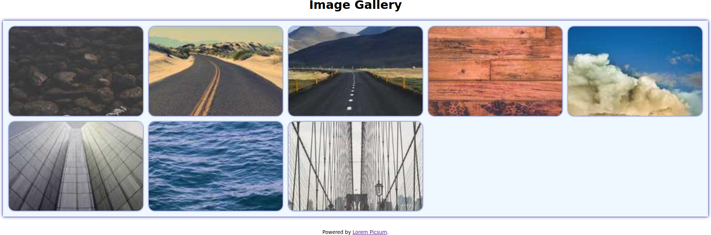

# Feladat

Készíts egy HTML-dokumentumot és egy CSS-stíluslapot nyolc véletlenszerűen generált kép az alábbi módon történő megjelenítéséhez:

Használd a [rácsos](https://developer.mozilla.org/en-US/docs/Learn/CSS/CSS_layout/Grids) elrendezést. A [Lorem Picsum](https://picsum.photos/) szolgáltatástól végy $300 \times 200$ pixel méretű random képeket. Használd a következő kép URL-eket: <https://picsum.photos/300/200?random=1>, <https://picsum.photos/300/200?random=2>, <https://picsum.photos/300/200?random=1>, stb.

Az elrendezés reszponzív kell, hogy legyen, azaz annyi képet kell egy sorban megjeleníteni, amennyit lehetséges.
