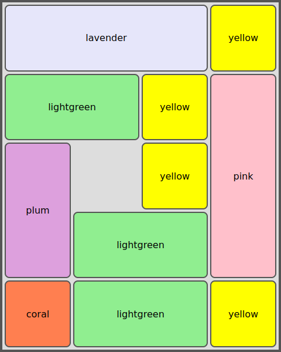

# Feladat

Készíts egy HTML oldalt és egy CSS stíluslapot az alábbi elrendezés megjelenítéséhez:

A színes elemeket tartalmazó téglalap alakú terület szélessége a nézetablak magasságának 40%-a, magassága a nézetablak magasságának 50%-a kell, hogy legyen, azaz a `vh` mértékegységet kell használni.  A [rácsos elrendezés](https://developer.mozilla.org/en-US/docs/Web/CSS/CSS_Grid_Layout) használatával kell megoldást adni.
