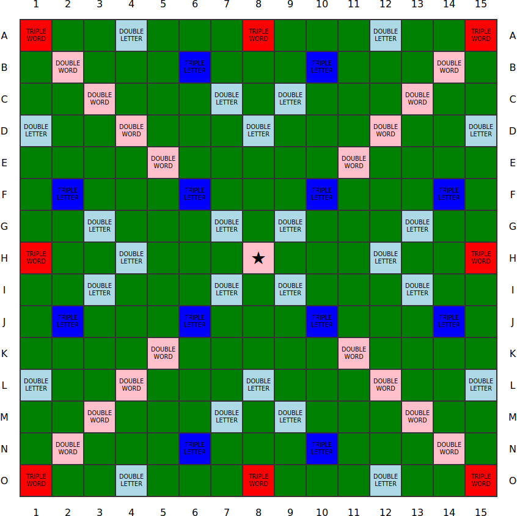

# Feladat

Készíts egy HTML oldalt és egy CSS stíluslapot az alábbi Scrabble tábla megjelenítéséhez:

A játéktáblát ábrázoló HTML táblázat létrehozása [Emmet rövidítések](https://docs.emmet.io/abbreviations/syntax/) segítségével történjen.

Készítsd el a HTML dokumentum egy olyan változatát, melyen a sorok és oszlopok automatikusan kerüljenek számozásra CSS számlálók segítségével. A hozzá tartozó CSS stíluslap az eredetit kell, hogy felhasználja egy `@import` at-szabály segítségével.
